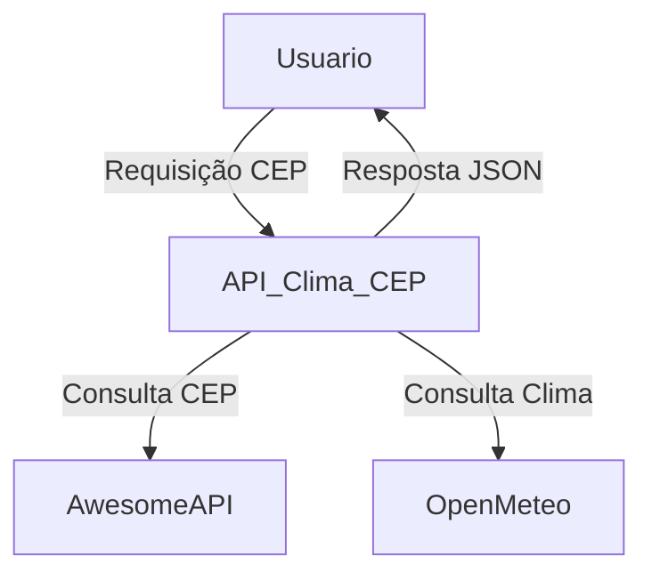

# API Clima-CEP

## Objetivo do Trabalho
Desenvolver uma API RESTful que integra informações de endereço (via CEP) e dados meteorológicos atuais e de previsão, utilizando APIs públicas. O objetivo é demonstrar habilidades de integração de sistemas, tratamento de dados externos e boas práticas de documentação.

### Relação com o ODS 11
Este projeto contribui para o Objetivo do ODS 11 **Cidades e Comunidades Sustentáveis** ao fornecer informações integradas sobre clima e localização urbana. A disponibilização de dados meteorológicos atualizados e previsões para diferentes regiões permite que cidadãos, gestores públicos e empresas tomem decisões mais informadas sobre mobilidade, planejamento urbano, prevenção de desastres e adaptação às mudanças climáticas, promovendo cidades mais resilientes, seguras e sustentáveis.

## Descrição Funcional da Solução
A solução permite ao usuário consultar o endereço de um CEP e obter o clima atual ou a previsão para os próximos 5 dias. O sistema faz requisições à AwesomeAPI para buscar dados do CEP e à Open-Meteo para obter informações meteorológicas. Os dados são consolidados e retornados em formato JSON, com tratamento de erros para CEPs inválidos ou falhas nas APIs externas.

## Arquitetura da API

- **Node.js + Express:** Backend da API.
- **Endpoints REST:** Para consulta de clima atual e previsão.
- **Integração Externa:** Consumo das APIs AwesomeAPI (CEP) e Open-Meteo (clima).
- **Testes Automatizados:** Utilizando Jest e Supertest.
- **Documentação:** Exemplos via Postman.

### Diagrama de Arquitetura



## Instruções para Execução via Postman/Insomnia

1. **Instale as dependências:**
   ```sh
   npm install
   ```
2. **Inicie o servidor:**
   ```sh
   npm start
   ```
3. **Importe a coleção Postman:**
   - Abra o Postman.
   - Clique em "Import" e selecione o arquivo `postman/collection.json`.
   - Os endpoints estarão prontos para uso.

4. **Exemplo de requisição no Postman/Insomnia:**
   - Método: `GET`
   - URL: `http://localhost:3000/api/clima/hoje/60170001`
   - URL: `http://localhost:3000/api/clima/previsao/60170001`

## Documentação das Rotas da API

### `GET /api/clima/hoje/:cep`
- **Descrição:** Retorna endereço e clima atual para o CEP informado.
- **Parâmetros:** `cep` (string, obrigatório)
- **Resposta:**
    ```json
    {
    "endereço": {
        "cep": "60170001",
        "endereço": "Avenida Desembargador Moreira",
        "cidade": "Fortaleza, CE",
        "bairro": "Aldeota"
        },
    "clima_atual": {
        "status": "Nublado",
        "temperatura": "25.5 ºC",
        "sensacao_termica": "28.6 ºC",
        "umidade": "79%",
        "precipitacao": "0 mm",
        "cobertura_nuvens": "100%",
        "pressao_do_ar": "1010.2 hPa"
        }
    }
    ```

### `GET /api/clima/previsao/:cep`
- **Descrição:** Retorna endereço e previsão do clima para os próximos 5 dias.
- **Parâmetros:** `cep` (string, obrigatório)
- **Resposta:**
    ```json
    {
    "endereço": {
        "cep": "60170001",
        "endereço": "Avenida Desembargador Moreira",
        "cidade": "Fortaleza, CE",
        "bairro": "Aldeota"
    },
    "previsao_5_dias": [
        {
            "data": "2025-09-27",
            "status": "Nublado",
            "temperatura_maxima": "34.8 ºC",
            "temperatura_minima": "23.4 ºC"
        },
        // ...mais 5 dias
        ]
    }
    ```

### Tratamento de Erros
- Para CEP inválido ou não encontrado, retorna:
    ```json
    {
      "erro": "CEP inválido ou não encontrado"
    }
    ```
- Para falha nas APIs externas, retorna mensagem e status apropriado.

## Testes
- Os testes automatizados estão em [tests/app.test.js](tests/app.test.js).

## Documentação Adicional
- Exemplos de requisições estão disponíveis em [postman/collection.json](postman/collection.json).

## Observações
- O projeto utiliza variáveis de ambiente para configuração (ver `.env`).
- Em caso de erro nas APIs externas, o sistema retorna mensagem de erro e status apropriado.