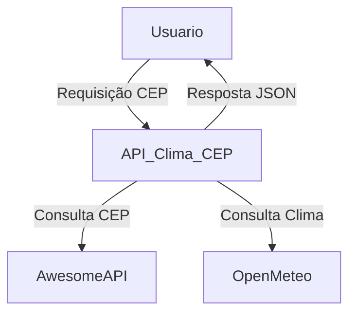

# Descrição da arquitetura

## Arquitetura da API Clima-CEP

A solução foi desenvolvida utilizando o padrão RESTful, com backend em Node.js e Express. O sistema integra dados de duas APIs públicas: AwesomeAPI (para consulta de endereço via CEP) e Open-Meteo (para informações meteorológicas atuais e previsão de 5 dias).

### Componentes principais

- **Node.js + Express:** Responsável pelo servidor e roteamento das requisições HTTP.
- **Endpoints REST:** Disponibilizam rotas para consulta de clima atual e previsão, recebendo o CEP como parâmetro.
- **Integração Externa:** O backend consome as APIs AwesomeAPI e Open-Meteo, consolidando os dados para o usuário.
- **Tratamento de Erros:** Respostas padronizadas para CEP inválido, não encontrado ou falha nas APIs externas.
- **Testes Automatizados:** Utilização de Jest e Supertest para garantir o funcionamento dos endpoints.
- **Documentação:** Exemplos de uso disponíveis via coleção Postman.

### Diagrama de Arquitetura

### Fluxo resumido

1. O usuário faz uma requisição HTTP informando um CEP.
2. A API consulta a AwesomeAPI para obter o endereço correspondente.
3. Com latitude e longitude do endereço, consulta a Open-Meteo para obter o clima atual ou previsão.
4. Os dados são consolidados e retornados em formato JSON.
5. Em caso de erro, o sistema retorna mensagem e status apropriado.

---

Esta arquitetura garante integração eficiente entre sistemas, tratamento de dados externos e facilidade de uso para o usuário final.